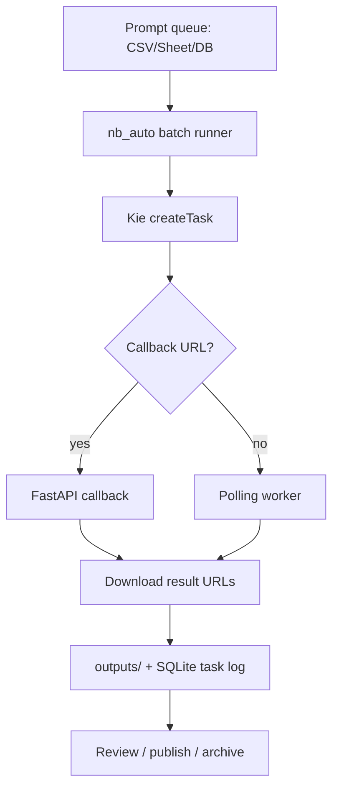

# Nano Banana Pro Automation · VIZIGROK Compaction

A Git-friendly automation scaffold for generating and retrieving images with Nano Banana Pro through Kie.ai, now wrapped as a **VIZIGROK compaction packet**.

This repo is intentionally useful in two ways:

1. It can run as a small Python automation.
2. It can rehydrate itself for future agents through Markdown, YAML, JSON, JSONL, Mermaid, OKF notes, and a live HTML cockpit.

## VIZIGROK quick map

```text
compaction/VIZIGROK_COMPACTION.md   # human anti-restart packet
compaction/VIZIGROK_PACKET.yaml     # agent-readable state packet
compaction/VIZIGROK_PACKET.json     # machine-ingestable packet
dashboards/vizigrok_compaction.html # visual cockpit
diagrams/vizigrok_nano_banana.mmd   # workflow topology
ledger/*.jsonl                      # append-only trail
okf/index.md                        # durable knowledge routing
CLAUDE.md                           # agent control plane
```

## What it does

- Submits Nano Banana Pro jobs to Kie.ai's asynchronous task API.
- Supports text-to-image and image-to-image/reference-image jobs.
- Polls task status with exponential backoff.
- Downloads completed image URLs immediately into `outputs/`.
- Keeps a local SQLite task log.
- Includes a FastAPI callback server for webhook mode.
- Includes `CLAUDE.md`, OKF notes, JSONL ledgers, and a reusable `SKILL.md` so agents can operate the repo cleanly.

## Quick start

```bash
python -m venv .venv
source .venv/bin/activate  # Windows PowerShell: .venv\Scripts\Activate.ps1
pip install -e .
cp .env.example .env
```

Edit `.env`:

```bash
KIE_API_KEY=your_kie_key_here
# Optional public webhook URL, e.g. from Cloudflare Tunnel or ngrok
KIE_CALLBACK_URL=
```

Submit one prompt:

```bash
python -m nb_auto.cli submit \
  --prompt "Black forest cheesecake ice cream ad, glossy product photo, readable label text" \
  --aspect-ratio 1:1 \
  --resolution 1K \
  --output-format png \
  --download
```

Submit a YAML job:

```bash
python -m nb_auto.cli submit-yaml configs/example_job.yaml --download
```

Poll a task:

```bash
python -m nb_auto.cli poll task_nano-banana-pro_123456789 --download
```

Run a CSV batch:

```bash
python -m nb_auto.cli batch configs/batch_prompts.csv --download
```

Run the callback server:

```bash
uvicorn nb_auto.callback_server:app --host 0.0.0.0 --port 8000
```

Open the VIZIGROK cockpit:

```bash
open dashboards/vizigrok_compaction.html
# Windows: start dashboards\vizigrok_compaction.html
```

## Inputs

Nano Banana Pro job input:

```yaml
prompt: "Your image prompt"
image_input: []       # Optional list of public image URLs, up to provider limit
aspect_ratio: "1:1"  # 1:1, 2:3, 3:2, 3:4, 4:3, 4:5, 5:4, 9:16, 16:9, 21:9, auto
resolution: "1K"     # 1K, 2K, 4K
output_format: "png" # png or jpg
```

## Security notes

- Never commit `.env`.
- Never put the Kie.ai API key into frontend code.
- Use IP allowlists and rate limits in the Kie dashboard where possible.
- Download outputs promptly because provider-hosted media URLs may expire.
- Do not automatically publish generated assets without a review gate.

## Suggested production wiring


